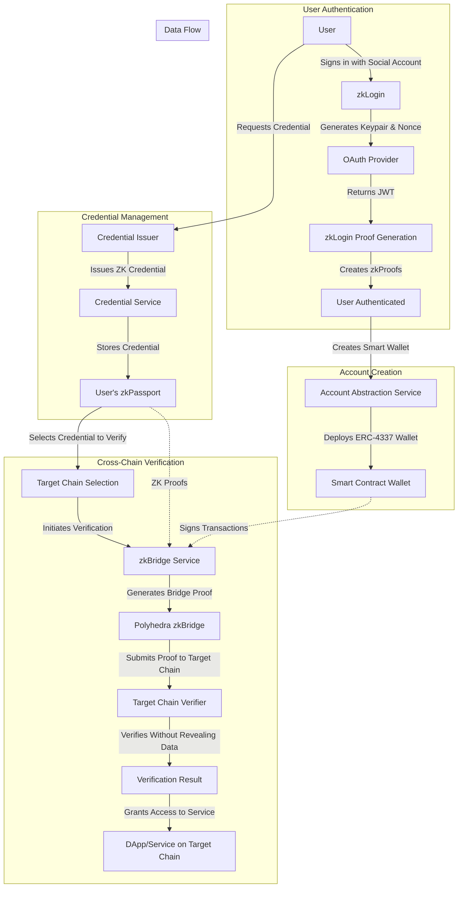

# zkPassport - Cross-Chain Privacy Identity Solution

zkPassport is a decentralized identity system that lets users prove credentials (e.g., KYC, DAO membership, age) across multiple blockchains without exposing personal data. It combines zkLogin for privacy-preserving authentication, Account Abstraction (ERC-4337) for improved user experience, and Polyhedra's zkBridge for cross-chain credential verification.

## Features

- **Privacy-Preserving Authentication**: Sign in with social accounts (Google, Facebook) using zkLogin
- **Account Abstraction**: Smart contract wallets with gasless transactions and enhanced security
- **Cross-Chain Verification**: Verify credentials across different blockchains without revealing personal data
- **Credential Management**: Request, store, and manage various types of verifiable credentials

## 4. Mermaid Diagram Flow



The diagram illustrates the complete zkPassport system flow:

1. User Authentication: The user authenticates via zkLogin using a social account, generating zero-knowledge proofs of their identity.

2. Account Creation: Upon authentication, an ERC-4337 compliant smart contract wallet is created for the user.

3. Credential Management: Users can request credentials from trusted issuers, which are stored in their zkPassport.

4. Cross-Chain Verification: When a user needs to verify credentials on another chain:
   - They select which credential to verify and on which target chain
   - The zkBridge Service generates a bridge proof
   - Polyhedra's zkBridge enables verification on the target chain
   - The target chain verifies the credential without revealing personal data
   - The user gains access to the desired service on the target chain

This architecture creates a seamless, privacy-preserving identity system that works across multiple blockchain ecosystems.

## Technology Stack

- **Frontend**: Next.js, React, TailwindCSS
- **Authentication**: zkLogin (Sui implementation)
- **Smart Contracts**: ERC-4337 Account Abstraction
- **Cross-Chain**: Polyhedra zkBridge
- **Zero-Knowledge Proofs**: Circom, SnarkJS

### Demo Video

## Getting Started

### Prerequisites

- Node.js 16+
- npm or yarn

### Installation

1. Clone the repository:
   ```
   git clone https://github.com/kamalbuilds/zkpassport.git
   cd zkpassport
   ```

2. Install dependencies:
   ```
   npm install
   ```

3. Set up environment variables:
   Create a `.env.local` file with the following variables:
   ```
   NEXT_PUBLIC_GOOGLE_CLIENT_ID=your_google_client_id
   NEXT_PUBLIC_FACEBOOK_CLIENT_ID=your_facebook_client_id
   NEXT_PUBLIC_REDIRECT_URI=http://localhost:3000/auth/callback
   NEXT_PUBLIC_PROVER_URL=https://prover.mystenlabs.com/v1
   NEXT_PUBLIC_SALT_SERVICE_URL=https://salt.api.mystenlabs.com/get_salt
   ```

4. Run the development server:
   ```
   npm run dev
   ```

5. Open [http://localhost:3000](http://localhost:3000) in your browser.

## Project Structure

- `/app`: Next.js app router pages
- `/components`: React components
  - `/zklogin`: zkLogin-specific components
  - `/ui`: Reusable UI components
- `/lib`: Utility functions and services
  - `/zklogin`: zkLogin and account abstraction services
- `/public`: Static assets

## Core Services

### zkLoginService

Handles authentication with social providers and generates zero-knowledge proofs.

### AccountAbstractionService

Manages smart contract wallet interactions, handles gas fees, and provides cross-chain verification capabilities.

### ZkBridgeService

Handles cross-chain proof verification using Polyhedra's zkBridge technology.

### CredentialService

Manages user credentials and provides functionality for creating, verifying, and managing credentials.

## Contributing

Contributions are welcome! Please feel free to submit a Pull Request.

## License

This project is licensed under the MIT License - see the LICENSE file for details.

## Acknowledgments

- [Sui zkLogin](https://docs.sui.io/concepts/cryptography/zklogin)
- [ERC-4337 Account Abstraction](https://eips.ethereum.org/EIPS/eip-4337)
- [Polyhedra zkBridge](https://docs.polyhedra.network/)
